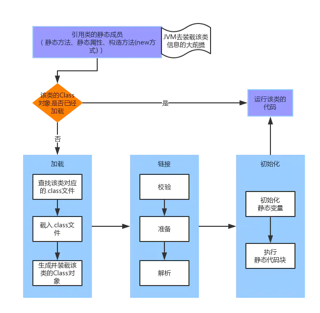
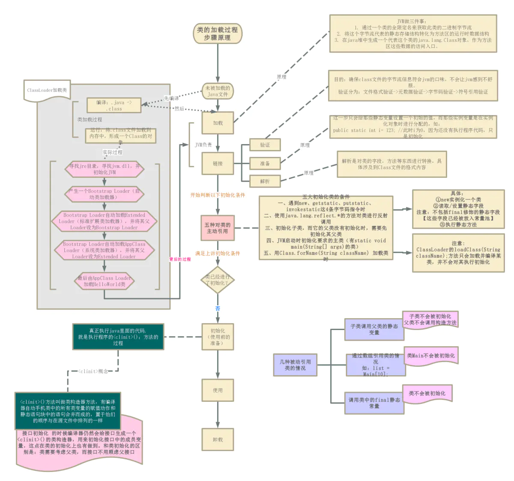

## 1. java的继承实现原理

> 参考网站：
>
> https://www.jianshu.com/p/ace2aa692f96
>
> [https://how2playlife.com/2019/09/23/23%E7%BB%A7%E6%89%BF%E3%80%81%E5%B0%81%E8%A3%85%E3%80%81%E5%A4%9A%E6%80%81%E7%9A%84%E5%AE%9E%E7%8E%B0%E5%8E%9F%E7%90%86/](https://how2playlife.com/2019/09/23/23继承、封装、多态的实现原理/)

```java

class Father {
    public String aaa = "我来测试aaa";
    public Father() {
        System.out.println("father this.getClass():"+this.getClass());//表示当前运行时的对象的class
        System.out.println("father this.hashCode(:"+this.hashCode());
        System.out.println("father this:"+this);
        System.out.println("father this.aaa:"+this.aaa);
        this.test();
    }
    private void test(){
        System.out.println("我是私有化的方法");
    }
    public int doWork() {
        System.out.println("我要去工作了");
        return 1;
    }
}
class Son extends Father {
    private String bbb = "我来测试bbb";
    //private Son this;
    public Son() {
        //super();
        System.out.println("son super.getClass():"+super.getClass());//所有的getClass都指向Object中的方法，根据this指针的对象去方法区找到对应的类，得到全限定类名。
        System.out.println("son.super.doWork"+super.doWork());
        System.out.println("son this.hashCode():"+this.hashCode());
        System.out.println("son this:"+this);
    }
}

public class FatherDemo{
    public static void main(String[] args) throws ClassNotFoundException {
        Father f = new Son();
    }
}


/*输出结果如下
//由于没有对象的创建，super()方法相当于在子类中执行一个father()方法，而子类对象拥有this指针，
father this.getClass():class tmp.Son
father this.hashCode(:356573597
father this:tmp.Son@1540e19d
father this.aaa:我来测试aaa
我是私有化的方法
son super.getClass():class tmp.Son
我要去工作了
son.super.doWork1
son this.hashCode():356573597
son this:tmp.Son@1540e19d
*/
//转载于:https://blog.51cto.com/sherwin28/1812119
```

**前提知识点：**

* JVM 上 new 一个对象包含 NEW 指令与 INVOKE_SPECIAL 指令调用，

  `NEW`完成创建对象的操作，

  `INVOKE_SPECIAL `调用新创建出来对象的 <init> 方法（也就是用来初始化）。
  当在子类的 constructor 里调用 super(xxx) 的时候只是调用了父类的 <init> 方法。

* 继承和初始化顺序，遇到new时：
  先分配空间（子类中的实例变量和父类中的实例变量）
  初始化默认值
  调用当前类的<init>（注意<init的结构）

* 每个类中至多存在一个<clinit>方法（没有静态属性和静态代码块时不存在），它从上往下收集所有的静态属性与静态代码块，当类加载时在<clinit>方法中统一初始化与执行，

* 子类可不可以访问父类的（静态）方法和（静态）属性完全取决于访问修饰符，如果是private就不可以访问，即没有继承


java中提供了以下四种创建对象的方式: 

* new创建新对象 （如：Demo demo= new Demo()）
* 通过反射机制 (如：clazz.newInstance()，或constructor.newInstance())
* 采用clone机制 (Demo demo=(Demo)Demo.clone(),Demo需先实现clonable接口)
* 通过序列化机制(Demo demo= (Demo) new ObjectInputStream(File).readObject();,Demo必须实现Serializable接口)

结论：**~~只调用super()不会创建对象~~**,子类将拥有（与继承概念不同）父类所有的属性，方法，构造器，能不能访问完全取决于访问修饰符。

java的继承可以理解为一种特殊的组合关系，可以简单认为每个java对象中有两个隐式的属性`this`和`super`，`this`是实际上的一个变量，在new时被赋值，`super`是java中的一个关键字，持有对父类中非private类型的实例变量，静态变量，方法的一个引用，在调用super时，不会创建一个实际的父类对象，但会分配父类实例字段所需要的空间，并在父类构造函数中初始化这些字段。

**个人理解**：可以理解为开辟一片内存空间存储父类中的所有实例变量，但并没有创建对象，这些实例变量与子类对象唯一绑定，由super关键字提供访问入口，且可以访问类信息，并且super关键字可以省略。只要有继承就有super，子类就可以访问父类，且会分配父类实例字段空间，但执行super()才会导致初始化）

* 在调用super()时，会从下至上追溯整个继承链，从Object的无参构造函数开始执行，直到父类时，再根据super()的参数决定执行哪一个构造函数

  > 所有的实例字段初始化 如 private String name="张三",都会收拢到每一个<init>（包含实例字段，初始化代码块，选择的构造函数，实例字段与初始化代码块按照类中的顺序执行，构造函数始终在最后）执行，
  >
  > tip: 通过aop直接生成的字节码文件代理类的构造函数`没有`编译器默认添加的super()，当通过反射创建对象时，被代理类中的所有实例字段都不会初始化，导致引用变量为null;

* `this`这个引用变量的类型为当前对象的类型，并在对象创建后指向当前对象，即存储当前对象的地址，每一个对象的this值不相同。

* `super`变量的类型为该类所继承的类的类型，调用构造函数初始化相应变量（并没有创建对象，静态成员变量在类加载时完成初始化，没有初始化的成员为默认值），子类的构造函数一定在父类后，因此子类对象的创建一定需要先初始化父类相应变量，即子类构造函数的第一行必须是super(...) 【没有的话编译器会自动添加】如果构造函数重载，可以为this(...),但super()或this()必须在第一行，所以同一个构造函数不可能同时调用super()和this()
* `sub.super.name=sub.name` `sub.super.super.toString()=sub.toString`即通过super访问对象的属性或方法时可以省略super，但实际上该对象并没有这个属性或方法，

## 2. 类加载全过程

**一个java程序的执行流程：**

1. java -jar demo.jar 或 java Demo 在操作系统启动一个java进程
2. 完成类加载器等的初始化与java基础类的加载
3. 加载main（）方法所在的类，如果有父类先加载父类，完成链接，初始化.
4. 开辟主线程栈，执行main方法，一行一行执行main方法，如果执行时引用的类未加载，进行加载，
   如果执行一个新的方法，则开启一个新的栈帧，方法执行完毕，栈帧退栈，如果需要开启一个新的线程，则新建一个栈和与之对应的程序计数器与本地方法栈，当所有线程的栈帧全部退栈，程序运行完毕，释放进程资源




###  程序运行时类的实际加载过程

当启动一个java程序时`java -jar xxx.jar 或 java demo` ，JVM先初始化，在JVM初始化的过程中，JVM生成几个ClassLoader，JVM调用指定的ClassLoader去加载.class文件等各类路径、文件的类。

>  `bootstrap`是一个c++层面的对象，在java中没有实际存在的类与对象， 它会加载`jre\lib\rt.jar`等目录中的所有类，`Object，Class`等基础类也是由它加载,将这些class文件（如`Class.class,Object.class`）读入内存，并完成所有后续步骤。

* JDK执行指令去寻找jre目录（通过环境变量`JAVA_HOME`可以找到），寻找jvm.dll，并初始化JVM  

* JVM进程会产生一个Bootstrap Loader（启动类加载器)，

* * BootstrapLoader自动加载`ExtClassLoader`（扩展类加载器）并将其父Loader设为Bootstrap Loader
  
   * BootstrapLoader自动加载`AppClassLoader`（应用类加载器），并将其父Loader设为Extended Loader。
   * 最后由AppClassLoader加载HelloWorld类。

### 各种ClassLoader及其特点

> 项目中读取外部属性文件时，如果需要配置JVM系统属性，那就需要使用java -D 配置系统属性。
> 使用格式是：java -Dkey=value，程序中读取采用System.getProperty("")方法
>
> 使用此参数的参数优先级最高，会覆盖项目中配置的此项；
>
> 所有的参数默认由jre运行时环境提供
>
> 如：java.io中的类都是将相对路径名解释为起始于用户当前工作目录，**可以通过调用`System.getProperty("user.dir");` 来获得。**

**BootstrapLoader（启动类加载器）：**加载System.getProperty("sun.boot.class.path")所指定的路径或jar

```java
 System.out.println(System.getProperty("sun.boot.class.path"));
//output:
C:\Program Files\Java\jdk1.8.0_181\jre\lib\resources.jar;
C:\Program Files\Java\jdk1.8.0_181\jre\lib\rt.jar;
C:\Program Files\Java\jdk1.8.0_181\jre\lib\sunrsasign.jar;
C:\Program Files\Java\jdk1.8.0_181\jre\lib\jsse.jar;
C:\Program Files\Java\jdk1.8.0_181\jre\lib\jce.jar;
C:\Program Files\Java\jdk1.8.0_181\jre\lib\charsets.jar;
C:\Program Files\Java\jdk1.8.0_181\jre\lib\jfr.jar;
C:\Program Files\Java\jdk1.8.0_181\jre\classes
    
//启动类加载器在应用启动时会加载所有指定目录下的文件

```

**ExtClassLoader (扩展类加载器)：**加载System.getProperty(`"java.ext.dirs"`)所指定的路径或jar。在使用Java运行程序时，也可以指定其搜索路径，例如：java -Djava.ext.dirs=d:\projects\testproj\classes  HelloWorld

**AppClassLoader（应用类加载器，也叫系统类加载器）：**加载System.getProperty(`"java.class.path"`)所指定的路径或jar。在使用Java运行程序时，也可以加上`-cp`或 `-classpath`来覆盖原有的Classpath设置，例如： java -cp ./lavasoft/classes   HelloWorld

>* AppClassLoader应用类加载器，又称系统类加载器，负责在JVM启动时加载来自命令java中的`-classpath`或者`-Djava.class.path`系统属性或者`CLASSPATH操作系统`属性所指定的`JAR类包和类路径`
>
>* Classpath是AppClassLoder默认的加载路径，此路径并不只是一个路径，每次设置三个属性中的任意一个只会在原有路径上`再添加一个路径`，设置`CLASSPATH操作系统`后所有应用的AppClassLoader加载类时都会去该路径查找是否含有需要加载的类，
>
>* ` AppClassLoader`默认加载main()方法所在的类,被一个类加载器加载的类中的方法需要再加载类时，如无直接说明，会默认再使用该类加载器加载该类。jar包中的MAINFEST.mf文件说明了main()方法所在类,从而可以确保整个应用的加载都是通过`AppClassLoader`加载。
>
>* 该Classpath不是项目中的classpath,前者指AppClassLoader查找的范围，后者指项目中保存`.class`文件的目录

**特点：**

1. ExtClassLoader和AppClassLoader在JVM启动后，会在JVM中保存一份，并且在程序运行中无法改变其搜索路径。如果想在运行时从其他搜索路径加载类，就要产生新的类加载器。
2. 运行一个程序时，总是由AppClassLoader（应用类加载器）开始加载指定的类，也就是说，除了java原生的类外，自己写的类默认都是由这个加载器加载
3. 在加载类时，每个类加载器会将加载任务上交给其父，如果其父找不到，再由自己去加载，也就是`双亲委派原则`，流程如下：
   1. 当程序运行中需要加载一个类时，首先`AppClassLoader`查找自身缓存【JVM为每一个类加载器维护一个表，表中存放所有以这个类加载器为初始类加载器的类，调用*findLoadedClass(String) 来检查是否已经加载类。*】是否已经加载，没有的话交给`ExtClassLoader`
   2. `ExtClassLoader`也查找自身缓存是否已经加载，没有的话交给`BootstrapClassLoader`
   3. `BootstrapClassLoader`也没有找到的话，抛出异常，被`ExtClassLoader`捕获，`ExtClassLoader`尝试在已指定的目录中加载，找到就走正常加载的流程，没有找到的话抛出异常
   4. `AppClassLoader`捕获异常，并尝试在指定目录加载，没有找到的话抛出`ClassNotFoundException`

**目的**：防止类恶意命名，破坏java原有的结构，如自定义一个`java.lang,String`，无论该类放在什么路径，由什么类加载器开始加载，最终都不可能加载成功，因为`BootstrapClassLoader`会发现已加载过该全路径名的类

### 类的加载方式

> 静态加载：启动应用时加载，可通过参数指定路径
>
> 动态加载：应用运行时加载，通过类全路径名在指定目录下加载

方式一：命令行启动应用时候由JVM初始化加载【静态加载】

方式二：通过Class.forName()方法`动态加载`（默认会执行初始化块<clinit>，但如果指定ClassLoader，初始化时不执行静态块  ）

方式三：通过ClassLoader.loadClass()方法`动态加载`（不会执行初始化块<clinit> ）

### 类的加载流程

**类的生命周期：**

详细步骤：编译 -> 加载 -> 链接（验证+准备+解析）->初始化（使用前的准备）->使用-> 卸载

简单理解的话三步：`加载，链接，初始化`

加载（除了自定义加载）和链接的过程是完全由jvm负责的，包括：加载 -> 验证 -> 准备 -> 解析

> 自定义需要定义一个类加载器，实现或重写相关方法，将类的class文件的字节数组装换成Class对象

**1.加载：**

这一块JVM要完成3件事：

1. 通过一个类的全限定名来获取定义此类的二进制字节流。

2. 将这个字节流所代表的静态存储结构转化为方法区的运行时数据结构，由磁盘存储转换到内存中存储。

3. 在java堆中生成一个代表这个类的`java.lang.Class`对象，作为方法区这些数据的`访问入口`。

   > 这个对象中无实际内容，但保存方法区中该类信息存储的起始地址，通过这个对象可以间接得到所有类有关的信息。（java8中静态字段这个对象保存在一起）

这一步很灵活,很多技术都是在这里切入，因为它并没有限定二进制流从哪里来，那么我们可以用系统的类加载器，也可以用自己的方式写加载器来控制字节流的获取：

1. 从class文件来->一般的文件加载
2. 从zip包中来->加载jar中的类
3. 从网络中来->Applet

> 很多框架通过自定义类加载器实现功能，如spring aop 将动态生成的代理类字节码文件通过指定目录加入到jvm中

获取二进制流获取完成后会按照jvm所需的方式保存在方法区中，同时会在java堆中实例化一个java.lang.Class对象与堆中的数据关联起来。

**2.验证：**

1. 一句话：检查代码的：`完整性、正确性、安全性`

- 主要经历几个步骤：文件格式验证->元数据验证->字节码验证->符号引用验证
  - *文件格式验证*：验证字节流是否符合Class文件格式的规范并 验证其版本是否能被当前的jvm版本所处理。ok没问题后，字节流就可以进入内存的方法区进行保存了。后面的3个校验都是在方法区进行的。
  - *元数据验证*：对字节码描述的信息进行语义化分析，保证其描述的内容符合java语言的语法规范。
  - *字节码检验*：最复杂，对方法体的内容进行检验，保证其在运行时不会作出什么出格的事来。
  - *符号引用验证*：来验证一些引用的真实性与可行性，比如代码里面引了其他类，这里就要去检测一下那些来究竟是否存在；或者说代码中访问了其他类的一些属性，这里就对那些属性的可以访问行进行了检验。（这一步将为后面的解析工作打下基础）
- 目的：确保class文件的字节流信息符合jvm的口味，不会让jvm感到不舒服。假如class文件是由纯粹的java代码编译过来的，自然不会出现类似于数组越界、跳转到不存在的代码块等不健康的问题，因为一旦出现这种现象，编译器就会拒绝编译了。但是，跟之前说的一样，Class文件流不一定是从java源码编译过来的，也可能是从网络或者其他地方过来的，甚至你可以自己用16进制写，假如jvm不对这些数据进行校验的话，可能一些有害的字节流会让jvm完全崩溃。

> 验证阶段很重要，但也不是必要的，假如说一些代码被反复使用并验证过可靠性了，实施阶段就可以尝试用-Xverify:none参数来关闭大部分的类验证措施，以减少类加载时间。

1. 随后是**准备**：
    一句话：`为静态域分配存储空间`

- 为类变量（静态变量）在方法区中分配内存空间。并赋予原始值，实现方法为简单的将分配的内存空间所有比特位的值清零

  例如：

  - `public static int value=123;`此时value的值为0，不是123。
  - `private int i = 123;` 此时，i 还未进行初始化，因为这句代码还不能执行。

1. 最后是**解析**：
    一句话：符号引用 -> 直接引用

- 是对类的字段，方法等东西进行转换，具体涉及到Class文件的格式内容。

如：

```java
public class demo{
    private String name;
    public void run(){
	System.out.printLn("hello");
}
}
//将name和它的字段描述符与所属类进行比较，确定name的位置，通过偏移量等可以在类中找到该值
//它由run()方法的全名和相关描述符组成,就是一个字符串（本质一串二进制数），它唯一对应一个方法。在解析阶段，Java虚拟机会把这个符号引用替换为一个指针，该指针指向Car类的run()方法在方法区的内存位置，这个指针就是直接引用。当程序中调用run()方法时，会将`run()`这个符号定位到内存中run()方法的起始位置
```

> 方法名和参数列表统称为**方法签名**,签名作为方法的唯一标识。

**3.初始化：**

为要初始化的类中的所有静态成员都赋予初始值、对类中所有静态块都执行一次，即执行<clinit>,并且是按代码编写顺序执行，即将所有静态字段，静态代码块从上到下收拢为一个大的静态代码块并执行。

**主动对类进行引用：**触发类的加载，并执行类的初始化，即执行<clinit>

1. 遇到new，getstatic，putstatic，invokestatic这4条字节码指令时，假如类还没进行初始化，则马上对其进行初始化工作。
    其实就是3种情况：

- 用new实例化一个类时
- 读取或者设置类的静态字段时（不包括被final修饰的静态字段，因为他们已经被塞进常量池了）
- 执行静态方法的时候。

1. 使用java.lang.reflect.*的方法对类进行反射调用的时候，如果类还没有进行过初始化，马上对其进行。
2. 初始化一个类的时候，如果他的父亲还没有被初始化，则先去初始化其父亲。
3. 当jvm启动时，用户需要指定一个要执行的主类（包含static void main(String[] args)的那个类），则jvm会先去初始化这个类。
4. 用Class.forName(String className);来加载类的时候，也会执行初始化动作。
    【注意:ClassLoader的loadClass(String className);方法只会加载并编译某类，并不会对其执行初始化】

**类被动引用：**触发类的加载，不触发初始化，即不执行<clinit>,但所有静态字段在准备阶段`已有原始值0`，并不一定为null;

1. 子类调用父类的静态变量（子类不会进行初始化，父类会初始化）

2. 通过<u>数组</u>引用类的情况（类Base不会被初始化）
    如：Base[] list = new Base[10];

3. 调用类中的<u>final静态常量</u>（类不会被初始化）,常量在编译阶段会被存入调用类的常量池中，本质上并没有引用到定义常量类类，所以自然不会触发定义常量的类的初始化 



* 对于类，会生成<clinit>(){……}方法体：去包含静态变量的赋值和静态块代码

* 而对于接口，也会生成<clinit>(){……}方法体：去初始化接口中的成员变量

* 接口和类初始化过程的区别：类的初始化执行之前要求父类全部都初始化完成了，但接口的初始化貌似对父接口的初始化不怎么感冒，也就是说，子接口初始化的时候并不要求其父接口也完成初始化，只有在真正使用到父接口的时候它才会被初始化（比如引用接口上的常量的时候啦）

## 3 java运算符

==  比较的是变量存的值：如

**对于引用类型**：变量存储的是对象的起始地址值，比较的也是对象在内存中的起始地址

**对于基本类型**：变量中存储的是基本数据的值，比较的就是这个值。

方法传参数时也是传的这个值。

```
Demo demo1=new Demo();
Demo demo2=new Demo();
system.out.printLn(demo1==demo2);//false,demo1和demo2是两个引用类型，存有对象地址的值，比较的是引用值
//equals 不重写默认比较两个引用的值是否相等
```

* 所有基本数据类型的包装类都重写了`equals()`方法，比较时应该使用这个方法而不是直接使用==
* 除了Double和Float，所有基本数据类型的包装类内部都有一个静态内部缓存类（如：`IntegerCache`），当第一次使用Integer时，如自动装箱使用`valueOf()`方法，在方法内部会读取IntegerCache的静态数组字段`cache`的值，触发静态内部类的加载，执行静态代码块，从而新建一个缓存数组对象并赋予【-128,127】的值，并判断基本类型的值是否在范围内，有则返回缓存数组中的对象，无则新建一个。

> &&短路运算符，&非短路运算符

```java
long n3 = 200;
//它并不存在含糊不清的地方，所以 200 后面的 L 大可省去。然而，对于下述语句：
float f4 = 1e-43f; //10 的幂数
编译器通常会将指数作为 double 类型来处理，所以假若没有这个后缀字符 f，编译器就会报错，提示我们应该将 double 型转换成 float 型。
```

* 按位“与运算符” `&`
* 按位“或运算符” `|`
* 按位“非运算符” `~` ，它只对一个自变量进行操作（其他所有运算符都是二元运算符）
* 按位“异或运算符” `^`
* `&=`，`|=` 和 `^=` 都是合法的

**位移运算符**

* 左移位运算符 `<<` 能将其左边的运算`对象`向左移动右侧指定的位数（在低位补 0）。

* 右移位运算符 `>>` 则相反。右移位运算符有“正”、“负”值：若值为正，则在高位插入 0；若值为负，则在高位插入 1。

* Java 也添加了一种“不分正负”的右移位运算符（>>>），它使用了“零扩展”（zero extension）：无论正负，都在高位插入 0。

>  如果我们对小于 **int** 的基本数据类型（即 **char**、**byte** 或 **short**）执行==任何算术或按位操作==，这些值会在执行操作之前类==提升为 **int**==，并且结果值的类型为 **int**。若想重新使用较小的类型，必须使用强制转换（由于重新分配回一个较小的类型，结果可能会丢失精度）。

## 4其他

> 如果从栈或静态存储区出发，遍历所有的引用，你将会发现所有"活"的对象。

>概括一下创建对象的过程，假设有个名为 **Dog** 的类：
>
>1. 即使没有显式地使用 **static** 关键字，构造器实际上也是静态方法。所以，当首次创建 **Dog** 类型的对象或是首次访问 **Dog** 类的静态方法或属性时，Java 解释器必须在类路径中查找，以定位 **Dog.class**。
>2. 当加载完 **Dog.class** 后（后面会学到，这将创建一个 **Class** 对象），有关静态初始化的所有动作都会执行。因此，静态初始化只会在首次加载 **Class** 对象时初始化一次。
>3. 当用 `new Dog()` 创建对象时，首先会在堆上为 **Dog** 对象分配足够的存储空间。
>4. 分配的存储空间首先会被清零，即会将 **Dog** 对象中的所有基本类型数据设置为默认值（数字会被置为 0，布尔型和字符型也相同），引用被置为 **null**。
>5. 执行所有出现在字段定义处的初始化动作。
>6. 执行构造器。你将会在"复用"这一章看到，这可能会牵涉到很多动作，尤其当涉及继承的时候。

> `{...}`初始化代码块这种语法对于支持"匿名内部类"的初始化是必须的

> 数组是协变的，子类数组继承父类数组。父类数组对象可以容纳子类对象，子类对象的引用可以赋值给父类对象的引用，如：
>
> ```java
> Object[] objects=new Object[10];
> objects[0]=new String("shf");
> String[] strings = new String[10];
> objects=strings;
> ```
>
> 泛型不是协变的，继承关系很复杂。

> enum的构造函数必须为`private`,保证单列的实现
>
> 创建 **enum** 时，编译器会自动添加一些有用的特性。例如，
>
> 它会创建 `toString()`和 `name()`方法，以便你方便地显示某个 **enum** 实例的名称，这从上面例子中的输出可以看出。
>
> 编译器还会创建 `ordinal()` 方法表示某个特定 **enum** 常量的声明顺序，
>
> `static values()` 方法按照 enum 常量的声明顺序，生成这些常量值构成的数组：

> **什么是类路径（classpath）？**
>
> 编译后保存class文件的路径，从顶级包名开始形成多级目录，Resource目录下的文件与顶级包名在同一目录下。
>
> **如何获取项目类编译后的路径?**
>
> **String path = 类名.class.getClassLoader().getResource("").getPath();**
>
> 如：/D:/develop/Repository/basic_demo/target/classes/
>
> **一个spring项目的目录结构：**
>
> * org:
>
> * META-INF:
>
>   * maven:包含pom.xml文件和pom.properties文件（包含该项目的gav信息）
>  * MANIFEST.MF:一个典型的springboot应用的MANIFEST.MF文件
>
>   ```properties
>  Manifest-Version: 1.0   #用来定义manifest文件的版本
>   Implementation-Title: plugin_test 
>   Implementation-Version: 0.0.1-SNAPSHOT
>   Start-Class: com.example.PluginTestApplication
>   Spring-Boot-Classes: BOOT-INF/classes/
>   Spring-Boot-Lib: BOOT-INF/lib/
>   Build-Jdk-Spec: 1.8
>   Spring-Boot-Version: 2.2.7.RELEASE
>   Created-By: Maven Archiver 3.4.0  #声明该文件的生成者，一般该属性是由jar命令行工具生成的
>   Main-Class: org.springframework.boot.loader.JarLauncher 
>   #定义jar文件的入口类，该类必须是一个可执行的类，一旦定义了该属性即可通过 java -jar x.jar来运行该jar文件。
>   ```
>
>   
>
> * BOOT-INFO:
>  * lib:引入的jar包
>   * classes:生成的class文件和Resource目录下的文件（就是常说的`classpath`【类路径】）
>
> **什么是java代码中的默认路径**（相对文件路径）?
>
> 文件位于相对于java虚拟机启动目录的位置
>
>  如（`new File("data/1.jpg")`）
>
> 如果是通过命令行启动程序，如：`java Demo `，代码中的相对文件的起始目录就是当前目录`./`。
>
> 如果是使用IDE，启动目录将由IDE控制，可以使用以下方法找到这个目录：
>
> `String dir=System.getProperty("user.dir")`
>
> idea默认启动目录是项目名下的子目录。
>
> **注意：**此路径不会打包进jar包，只在项目的源代码中存在。通过`java -jar`命令运行的项目建议使用绝对路径，如果必须需要可以将目录放进classpath下，
>
> 使用命令行启动程序时 可以重定向 System.in 和System.out,如：
>
> ` java Demo < myfile.txt>output.txt`
>
> 程序中的的System.in将读取指定的文件内容，并输出到指定文件而不是屏幕上

> 在不使用`intern()`方法的情况下，只有字符串字面量对象的引用会加入字符串常量池,使用`subString()`,`+`等手段得到的字符串对象引用不会加入字符串常量池。字符串常量池在整个jvm只有一个，也就是说所有类共用一个字符串常量池

> 在java9中，只包含单字节代码单元的字符串使用byte数组实现，其他所有字符串使用char数组。

> javac 编译器参数 
>
> 如 `-d` `-classpath` 表示标准选项，标准选项是指在当前版本的开发环境中支持，且在未来版本中也将被支持的选项
>
>  如 `-Xlint ` ,非标准选项是在当前版本的开发环境中支持，但不能保证将来一定会继续支持的选项。非标准选项都由 -X 开头，比如我们这里所关心的 Java Lint 
>
>  `-Xlint` ：启用所有警告。该选项相当于 -Xlint:all 选项。相反，关闭所有警告的选项为 -Xlint:none。 
>
> `-Xlint:unchecked` ：启用对所谓的未经检查的转换（unchecked warning）的警告。这个警告涉及 JDK 5.0 中的新特性——范型（Generic 
> Type），这绝对是另外一个故事了。有兴趣的话，可以在 Internet 上搜索到很多关于范型的文章。 
> `-Xlint:path` ：当发现不存在的路径或者目录时给出警告，比如标准选项中的类路径（classpath），源代码路径（sourcepath）等等。 
> `-Xlint:serial` ：当在可序列化的类中没有发现 serialVersionUID 的定义时，给出警告。 
> `Xlint:finally` ：当发现 finally 子句无法正常结束的情况时给出警告。比如下面这段代码： 
>
> ```java
> try { 
> 	
> 	} 
> catch (Exception e) { 
> } finally { 
>   for (;;); 
> } 
> ```
>
> 

> 标签可以应用于任何语句块，如：
>
> ```java
> label:
> {
> if(a>b){
> break label;
> }
> }//将跳转到这
> //实现类似goto的效果；
> ```
>
> 

> **protected访问修饰符** 
>
> ```java
> class Tmp {
>     protected String age;
>     protected void test(){
>         System.out.println("hello");
>     }
> }
> class Tmp2 {
>     public static void main(String[] args) throws CloneNotSupportedException {
>          
>        Tmp tmp = new Tmp();
>         //下面这行代码无法执行 object的clone方法是protect修饰，protect方法有两种调用方式，
>         //1是在`package java.lang`包中新建类再创建Object对象调用clone（）方法，显然我们不可能在java.lang包中创建类，
>         //2是继承Object类，在继承的类内部方法中可以通过super.clone访问,或者创建该类的一个对象再调用方法，这都符合在子类中访问父类的protect方法。
>         //下面一行tmp对象的clone方法只能在Tmp类中执行,不能在其他类中调用
>         //总结：除同包外，继承的protect方法只能在子类内部访问。
>         Tmp tmpClone =tmp.clone();//不能访问
>         
>         Tmp2 tmp2 = new Tmp2();
>         Tmp2 tmp2Clone = (Tmp2) tmp2.clone();//Tmp 是Obect子类且在Tmp2内部调用，可以访问
>         System.out.println(tmp.age);//Tmp2与 Tmp 同包可以访问
>         tmp.test();//Tmp2与 Tmp 同包可以访问
>     }
> }
> 
> ```
>
> 正确使用clone方法的方式
>
> 1. 实现cloneable接口
> 2. 重写clone方法
> 3. 修改clone方法访问修饰符为public

>Object类中的所有native方法作用的都是对象本身，即使该对象继承了其他类，因为Object所有本地方法都被final修饰，不能重写，因此所有对象调用的方法，如：getClass,clone,hashcode等方法都指向object中的方法，
>
>这些本地方法根据对象本身（由this指针拿到对象）返回相应的值。