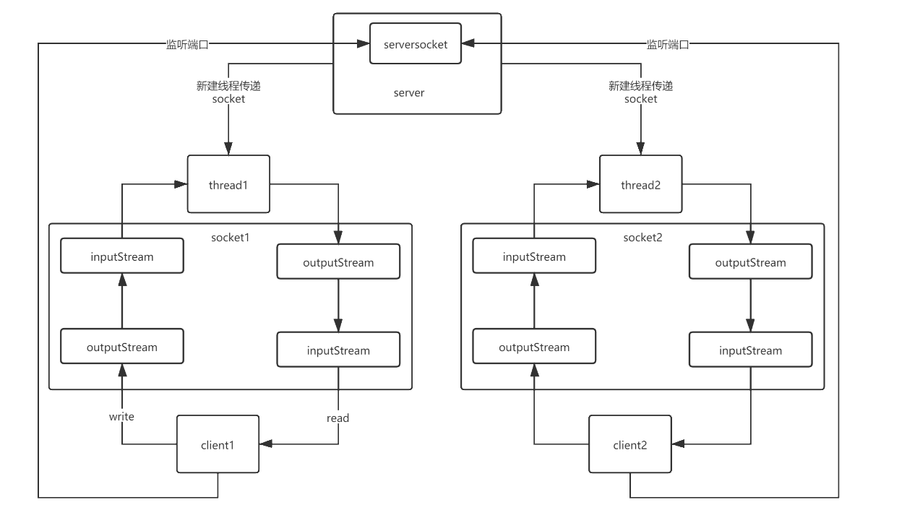
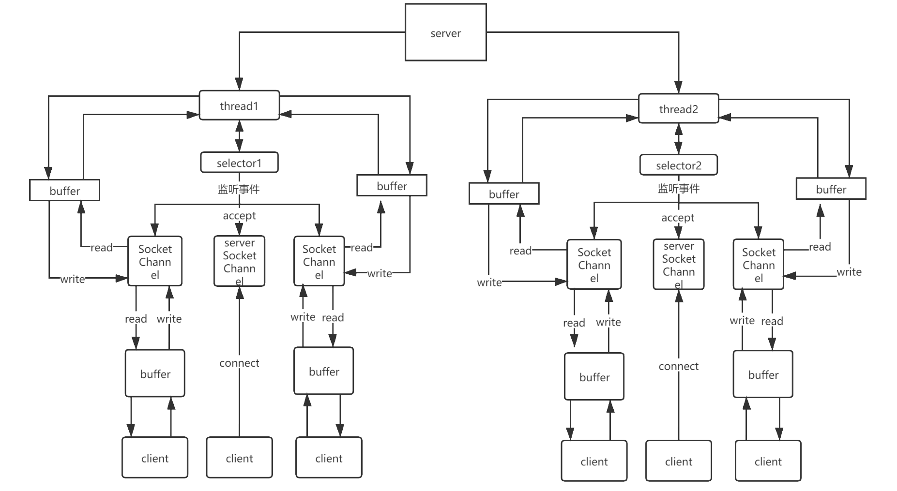
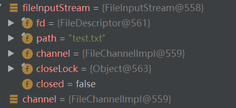
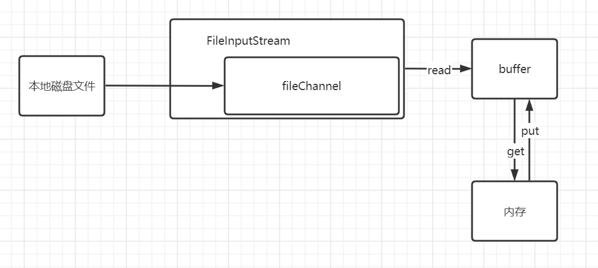
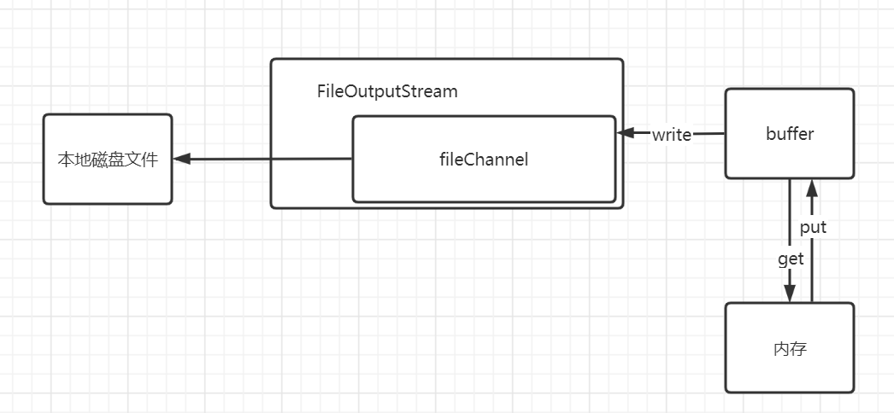

# netty学习笔记

## 传统BIO网络模型



```java
public class Demo1 {
    public static void main(String[] args) throws IOException {
        ExecutorService threadPool = Executors.newCachedThreadPool();
        ServerSocket serverSocket = new ServerSocket(6666);
        while (true){
            System.out.println(Thread.currentThread().getName()+"等待连接");
            Socket accept = serverSocket.accept();//此处主线程一直阻塞，等待连接
            threadPool.execute(()->{
                try {
                    System.out.println(Thread.currentThread().getName()+"连接成功");
                    handler(accept);
                } catch (IOException e) {
                    e.printStackTrace();
                }
            });

        }
    }
    private static void handler(Socket socket) throws IOException {
        InputStream inputStream = socket.getInputStream();
        byte[] bytes = new byte[1024];
        while(true){
            System.out.println(Thread.currentThread().getName()+"等待输入");
            int len = inputStream.read(bytes);//此处新创建的线程一直阻塞，等待输入
            if (len!=-1){
                System.out.println(Thread.currentThread().getName()+"输出："+new String(bytes,0,len,"GBK"));
            }
            else {
                break;
            }
        }
        System.out.println(Thread.currentThread().getName()+"断开连接");
    }
}
```

```shell
客户端请求方式：
telnet 127.0.0.1 6666
按住`ctrl`+`]`进入交互模式
send hello //输入 `send` +要发送的内容
quit //输入quit断开连接
```


## NIO网络模型



**服务器端代码：**

```java
public class Demo5 {
    public static void main(String[] args) throws IOException {
        ServerSocketChannel serverSocketChannel = ServerSocketChannel.open();
        Selector selector = Selector.open();
        serverSocketChannel.configureBlocking(false);//以非阻塞方式连接
        serverSocketChannel.socket().bind(new InetSocketAddress(6666));
        //注册serverSocketChannel到selector中，选择监听accept事件
        serverSocketChannel.register(selector, SelectionKey.OP_ACCEPT);
        while (true){
            if (selector.select(1000)==0){//线程阻塞一秒监听所有channel,如果没有事件发生返回0
                //这里可以执行主线程自己的任务
                System.out.println(Thread.currentThread().getName()+"阻塞一秒，未发现事件发生");
                continue;
            }
            //如果有事件发生，遍历所有有事件发生的通道，而keys()方法获取所有注册的通道
            Set<SelectionKey> selectionKeys = selector.selectedKeys();
            Iterator<SelectionKey> iterator = selectionKeys.iterator();
            while (iterator.hasNext()){
                SelectionKey selectionKey=iterator.next();
                //如果是请求创建连接的事件，新建一个SocketChannel并加入到selector中
                if (selectionKey.isAcceptable()){
                    SocketChannel channel = serverSocketChannel.accept();
                    channel.configureBlocking(false);
                    //注册channel,选择监听read事件，并绑定一个ByteBuffer
                    channel.register(selector,selectionKey.OP_READ, ByteBuffer.allocate(1024));
                }
                //如果通道数据传输完毕，可以读取，即读取数据并输出到屏幕
                if (selectionKey.isReadable()){
                    SocketChannel channel = (SocketChannel) selectionKey.channel();
                    ByteBuffer buffer = (ByteBuffer) selectionKey.attachment();
                    int len = channel.read(buffer);
                    System.out.println("服务器接收到以下信息："+new String(buffer.array()));
                }
                iterator.remove();//删除内部集合中已遍历的selectionKey
            }
        }

    }
}
```

**客户端代码：**

```java
public class Demo6 {
    public static void main(String[] args) throws IOException {
        SocketChannel socketChannel = SocketChannel.open();
        socketChannel.configureBlocking(false);
        if (!socketChannel.connect(new InetSocketAddress("localhost",6666))) {
            if (!socketChannel.finishConnect()){
                System.out.println("正在请求连接");
            }
        }
        ByteBuffer byteBuffer = ByteBuffer.wrap("hello,server".getBytes());
        socketChannel.write(byteBuffer);
        System.in.read();//保持连接不断
    }
}
```


## 1.buffer

### 1.1 重要属性


```java
//以下标记位均对应hb数组下标
private int mark = -1;  //标记位，可以直接从此位置读写
private int position = 0;   //实际读/写的位置
private int limit;   //限制读写的位置，初始为capacity,
private int capacity;//hb数组最大容量

final byte[] hb;      //内存中实际存储数据的数组          
boolean isReadOnly;		//是否只读
```

### 1.2 重要方法

```java
 FileChannel channel = fileInputStream.getChannel();//获取通道
 ByteBuffer byteBuffer = ByteBuffer.allocate(1024);//分配hb数组大小
 byteBuffer.put((byte) 10);//存放数据 position+1;
 byteBuffer.flip(); //position清零，limit为清零前position位置,读写转换时使用
 byteBuffer.get(); //从position位置读取数据 position-1;
 byteBuffer.clear(); //所有标志位回归初始状态，循环读必须使用。否则因为数组默认的值为0，channel.read将一直读取position的位置的值0，循环无法结束
 byteBuffer.array();//将bytebuffer转为byte数组，读取数据时使用配合生成字符串
 byteBuffer.wrap("hello".getBytes);//返回一个ByteBuffer,以传入的数组作为hb数组
```

**设置通道只读**

```java
//将buffer复制一份，共享原来的数据与位置信息，复制的新buffer不能写，只能读
// 原buffer可以在原有数组上修改数据的值，但不能新增数据，且修改后复制的buffer就不能读写，（因为共享）
IntBuffer buffer1 = buffer.asReadOnlyBuffer();
```


## 2.channel

### 2.1重要方法

#### 2.1.1获取通道

```java
//虽然buffer可读可写，但通过输入流获取的channel只能读，没有write方法，输出流同理
FileChannel channel = fileInputStream.getChannel();//获取通道

```



从图可以知道，在文件流中channel是fileinputStream的一个属性，fileInputStram对其进行了包装

```java
 public FileChannel getChannel() {
        synchronized (this) {
            if (channel == null) {
               //FileChannel是一个抽象类，实际使用的是其实现类FileChannelImpl.其他channel类似
                channel = FileChannelImpl.open(fd, path, true, false, this);
            }
            return channel;
        }
    }
```

#### 2.1.2文件输入

```java
//读取本地文件数据读取到chnnel中再保存到bytebuffer中，len为实际读取到的字节长度，
//如果读取到文件末尾（EOF），将返回本次读到的字节数量，下一次循环时从当前位置（EOF）读将返回len为-1,
//window下换行符\r\n占两个字节，mac os换行\r，linux换行\n各占一个字节。所以实际创建的字符串大小会比实际字符大
int len = channel.read(byteBuffer);
```




#### 2.1.3文件输出

```java
//byteBuffer中的数据写入到通道中，在输出到本地文件中，返回值为输出字节数，
int len = channel.write(byteBuffer);
```



#### 2.1.4输入输出

```java
//复制channel数据,两个方法作用相同，任选其一，参数类型为起始位置，数据大小，目标通道
//零拷贝，加快文件传输速度
 inputChannel.transferTo(0,inputChannel.size(),outputChannel);
 outputChannel.transferFrom(inputChannel,0,inputChannel.size());
```

#### 2.1.5修改文件

```java
  //直接读取文件到（直接）内存中进行修改，不需要再复制一遍到jvm管理的内存中
   RandomAccessFile randomAccessFile = new RandomAccessFile("test.txt","rw");
   FileChannel channel = randomAccessFile.getChannel();
   //参数说明（读写模式，起始字节偏移量，偏移量后可以修改的字节数）
   MappedByteBuffer map = channel.map(FileChannel.MapMode.READ_WRITE, 0, 5);
   map.put(0,(byte)'H');//修改以起始字节偏移量为标准下标为0（即第一个字节）的字节为'H'
   map.put(2,(byte)'B');//修改以起始字节偏移量为标准下标为2（即第三个字节）个字节为'B'
   channel.close();
```

